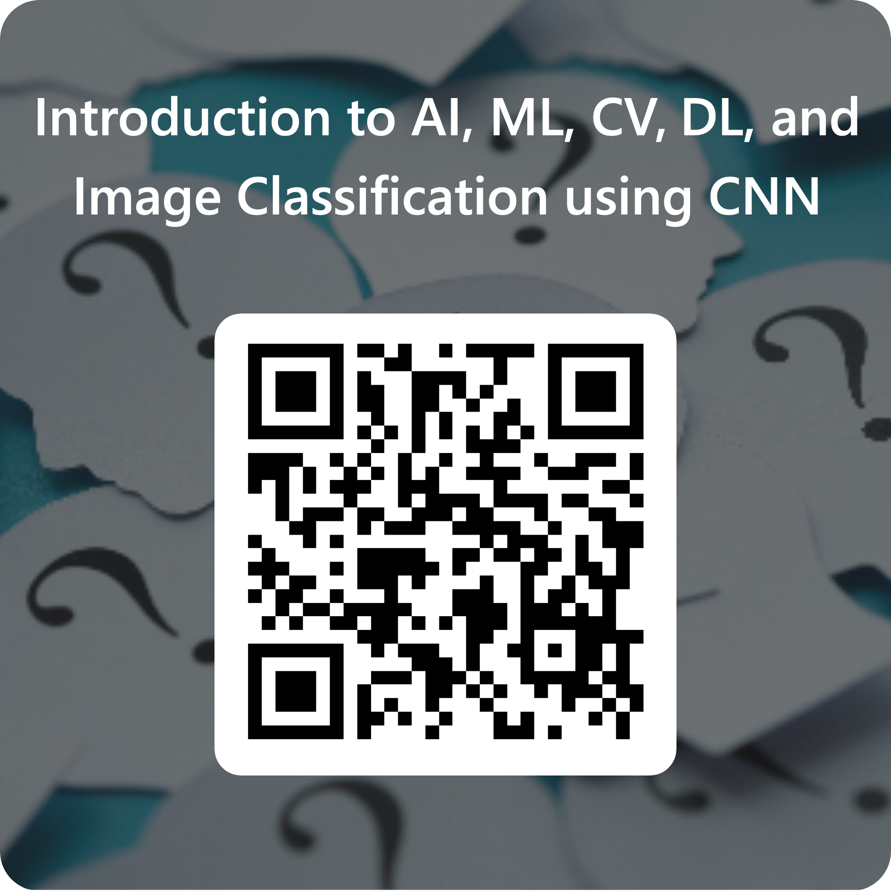

# DFAT Korea's Visit to the   University of Technology Sydney (UTS)

## Event Details:
* **When:** Nov 20, 2024, 10.00am - 1.00pm
* **Where:** CB08.02.005

## Speaker
* **Dr. Nabin Sharma, PhD, SMIEEE**  
Associate Professor, 
Co-Director (Intelligent Drone Lab), 
Course Director: Master and Bachelor of Artificial Intelligence  
Faculty of Engineering and Information Technology, 
University of Technology Sydney, 
School of Computer Science, 
Broadway, Ultimo, NSW 2007 Australia 
**Email**: Nabin.Sharma@uts.edu.au

* **Dr. Maoying Qiao,**  
  Senior Lecturer, 
  School of Computer Science, 
  Broadway, Ultimo, NSW 2007 Australia 
  **Email**: maoying.qiao@uts.edu.au

## Session Title
Foundations of AI, ML, CV, DL, and CNNs for Image Classification

## Topics:
* Introduction to AI, ML, CV, & DL
* Popular Computer Vision tasks and use case
* Generative AI
* Features in Machine Learning
* Basics of CNN and Image classification  
* Image Classification Demo
* AI Projects @ UTS

## Demo
* Image Classification using CNN (Train and Testing using Fashion MNIST dataset)

## References:
* OpenCV Tutorial and reference: <a>https://github.com/dalgu90/opencv-tutorial</a>
* Python and Numpy: <a>https://cs231n.github.io/python-numpy-tutorial/ </a>
* Numpy: <a>https://numpy.org/learn/ </a>
* Pythorch : <a> https://pytorch.org/tutorials/ </a>
* Deep Learning: 
  1.(<a>http://www.deeplearningbook.org/ </a>) (<a>https://github.com/janishar/mit-deep-learning-book-pdf</a>) 
  2. <a>https://d2l.ai/index.html</a>

## Computing resources:
* Google Colab (Free Version can be used for the Demo iPython notebook)

## Survey

Click to provide your feedback -->  <a>https://forms.office.com/r/zzcAgMzuFu?embed=true</a>  
or Scan the QR Code below: 

